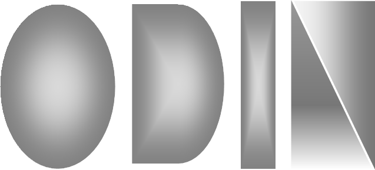

# Odin Runes



Welcome to Odin Runes, a powerful GPT (Generative Pre-trained Transformer) client that revolutionizes the way you interact with GPT models. With Odin Runes, you can seamlessly integrate with various GPT providers, overcoming vendor lock-in and unlocking the true potential of natural language processing. Through a simple and intuitive GUI, Odin Runes enables you to chat with your chosen GPT right through your favorite text editor. It also empowers you to capture context from various sources, such as clipboard, OCR from a region on the screen, and OCR from an entire scrollable region on the screen, providing valuable context to GPT models for more accurate and meaningful responses. This comprehensive README.md will guide you through the features, advantages, setup, usage, configuration, and resources of Odin Runes. (stay tuned for Demo video!)

[](https://leonid20000.github.io/OdinRunes/org/odinware/odinrunes/package-summary.html)[](https://leonid20000.github.io/OdinRunes/org/odinware/odinrunes/package-summary.html)

## Odin Runes Wiki

For a quick peek at the various use cases and capabilities of Odin Runes, feel free to explore [Odin Runes Wiki](https://github.com/leonid20000/OdinRunes/wiki). The wiki contains many short gif demos that showcase the unique features and functionality of Odin Runes. It is regularly updated with new content to keep you informed about the latest advancements and possibilities with Odin Runes.


## Demo Video

Experience the power of OdinRunes in action with an engaging demo. Click the play button below to witness how this useful java tool, driven by GPTs, boosts your productivity and saves you valuable time:

[](https://www.youtube.com/watch?v=8BPGULLC3Os)


## Major Updates

- **Integration of gpt-4o-mini** (OdinRunes-1.5-SNAPSHOT July 20, 2024): OdinRunes now includes support for gpt-4o-mini, allowing users to supply images within the context for enhanced capabilities. [see demo](https://github.com/leonid20000/OdinRunes/wiki#how-to-query-your-cctv-cameras-using-gpt)
- **Support for Ollama** (OdinRunes-1.2-SNAPSHOT February 9, 2024): Odin Runes now includes support for Ollama, an open-source tool available at [https://github.com/ollama/ollama](https://github.com/ollama/ollama). Ollama facilitates the local execution of multiple open-source LLMs (Language Model Models).

## Table of Contents
- [Features](#features)
- [Advantages of Using Odin Runes](#advantages-of-using-odin-runes)
- [Setup and Installation](#installation)
- [Dependencies](#dependencies)
- [Usage](#usage)
    - [1. Capturing Context](#1-capturing-context)
        - [1.1. Capture context from Clipboard](#11-capture-context-from-clipboard)
        - [1.2. Capture context from Region](#12-capture-context-from-region)
        - [1.3. Capture context from Scrollable Region](#13-capture-context-from-scrollable-region)
        - [1.4. Capture context from File](#14-capture-context-from-file)
    - [2. Choosing a GPT Provider](#2-choosing-a-gpt-provider)
    - [3. Initiating a Chat](#3-initiating-a-chat)
    - [4. Appending Prompts](#4-appending-prompts)
    - [5. Saving Context](#5-saving-context)
    - [6. Loading Context](#6-loading-context)
- [Contributors](#contributors)
- [License](#license)
- [Resources](#resources)

## Features

Odin Runes offers a range of powerful features that enhance your interaction with GPT models:

- Interact with your desired GPT right through your favorite text editor
- Avoid vendor lock-in with a multi-cloud approach
- Switch to the GPT provider of your choice seamlessly, including locally deployed open-source LLMs. 
- Capture context from various sources such as clipboard, OCR from a region on the screen, OCR from an entire scrollable region on the screen, and dynamically from a file
- Save context and load it in different conversations
- Save chats independently from their context for greater flexibility

## Advantages of Using Odin Runes

Odin Runes offers several advantages over traditional GPT clients:

- **Avoid Vendor Lock-in**: By embracing a multi-cloud approach, Odin Runes liberates you from vendor lock-in. You are no longer constrained to a single GPT provider, giving you the freedom to choose the provider that offers the best performance, cost-effectiveness, or features for your specific application. This flexibility ensures you can adapt to changing requirements and leverage the advancements of different GPT providers. Odin Runes currently integrates with several GPT providers, including OpenAI's gpt-3.5-turbo, as well as Google's gemini-pro, and chat-bison via GCP's VertexAI. Stay tuned for future integrations with additional GPT providers. Additionally, Odin Runes offers the flexibility to integrate your own GPT providers by implementing the WellsOfWisdom Interface. This allows you to expand the platform's capabilities and incorporate your preferred GPT provider seamlessly. For more information on how to integrate your own provider, please watch the demo provided. 

- **Enhanced User Experience**: By seamlessly integrating GPT models with your favorite text editor through Odin Runes, you can unlock a host of benefits. You'll have the power to leverage the extensive features of your trusted text editor, making your interactions with GPT models more versatile and efficient. Imagine being able to utilize powerful text editing capabilities such as syntax highlighting, code folding, and search-and-replace functionality while conversing with GPT models. This integration allows you to harness the full potential of GPT models within the familiar environment of your text editor. Moreover, because chat sessions are stored as files on your file system, you can take advantage of existing operating system features like grep to easily search and manage your past conversations with GPT models. 

- **Improved Contextual Understanding**: Odin Runes allows you to provide context to GPT models through various sources such as clipboard, OCR-based screen region capture, OCR-based scrollable region capture, and dynamically from a file. By enriching conversations with relevant information, the GPT models possess a better understanding of the context, leading to more accurate and meaningful responses. This contextual understanding enables applications like document summarization, content generation, and more.

- **Effortless Context and Chat Management**: With Odin Runes, managing context and chats becomes seamless. You can save and load context independently, facilitating the reuse of previously saved context across multiple conversations. Furthermore, saving and loading chats independently allows for greater flexibility and control over the conversations. This effortless context and chat management streamlines your workflow and enables efficient interaction with GPT models.

- **Easy Integration with New Models**: Odin Runes' modular design provides a solid foundation for integrating new GPT models and providers. Adding support for new models is made easier by extending the existing codebase and implementing the custom GPT interface. As the landscape of GPT models evolves, you can effortlessly integrate and experiment with emerging models without the need to rework the entire application.
  
- **Flexibility with Open-Source LLMs**: Odin Runes now allows you to leverage Ollama to execute multiple open-source LLMs locally. By integrating Ollama into Odin Runes, you can take advantage of the diverse range of open-source LLMs available in the Ollama repository, expanding your options for language model models.

## Installation

To install and set up Odin Runes, follow these steps:

1. Clone the repository to your local machine:

   ```
   git clone https://github.com/leonid20000/OdinRunes.git
   ```

2. Navigate to the project directory:

   ```
   cd OdinRunes
   ```

3. Build the project using Maven:

   ```
   mvn clean install
   ```

4. Ensure that the necessary dependencies are installed and added to your project. You can find the list of dependencies in the `pom.xml` file. (Maven helps you with this)

5. Set up the required environment variables:

    - `GCLOUD_VERTEX_AI_ACCESS_TOKEN`: Set this environment variable to the access token for the Google Cloud Vertex AI. It is needed to authenticate requests to the Vertex AI API. (*Required for using Google's GPT APIs.*)

    - `OPENAI_API_KEY_ODIN_FIRST`: Set this environment variable to the API key for OpenAI. (*Required for using OpenAI's GPT APIs.*)

    - `TESSDATA_PREFIX`: Set this environment variable to the path where Tesseract's `tessdata` folder is located. It is needed for Tesseract to locate the necessary language data for OCR. 

    - `VERTEXAI_API_ENDPOINT`: Set this environment variable to the API endpoint for Google Cloud Vertex AI. It specifies the location of the Vertex AI service for making API requests. (*Required for using Google's GPT APIs.*)

    - `VERTEXAI_PROJECT_ID`: Set this environment variable to the project ID for your Google Cloud project. It is required to make API requests to the Vertex AI service. (*Required for using Google's GPT APIs.*)

6. Once the installation and setup are complete, you can run Odin Runes. You can run Odin Runes by double-clicking on the JAR file `target/OdinRunes-1.5-SNAPSHOT-jar-with-dependencies.jar` or alternatively by using the following command:

   ```
   java -jar target/OdinRunes-1.5-SNAPSHOT-jar-with-dependencies.jar
   ```

   This will start the Odin Runes application.

Congratulations! You have successfully installed and set up Odin Runes. Refer to the [Usage](#usage) section in the README.md file for instructions on how to use Odin Runes to interact with GPT models.


## Dependencies

To leverage the capabilities of Odin Runes, you will need to set up the necessary dependencies (Maven will help you with most parts):

- **SikuliX**: For capturing screenshots and interacting with graphical elements.
- **Tesseract**: For extracting text from images using OCR (Optical Character Recognition).
- **OkHttp**: For making HTTP requests to GPT providers.
- **JSON Libraries**: For parsing and manipulating JSON data.


## Usage

Using Odin Runes to interact with GPT models is straightforward. The usage can be divided into different scenarios:

### 1. Capturing Context

Before or during a chat session with a desired GPT model, you can capture and add relevant context from different sources. Odin Runes provides the following context capture options (stay tuned for more options):

#### 1.1. Capture context from Clipboard

Click the "Add context from Clipboard" button to capture text from the clipboard. The captured text will be displayed in the "Context" section of the Settings panel.

#### 1.2. Capture context from Region

Click the "Add context from Regionshot" button to capture text from a specific region on the screen using OCR. This allows you to provide precise context from a specific area of your screen.

#### 1.3. Capture context from Scrollable Region

Click the "Add context from Scrollshot" button to capture text from a scrollable region on the screen using OCR. This captures the entire content visible within the scrollable region, virtually enabling you to capture context from anywhere.

#### 1.4. Capture context from File

Click the "Add context from File" button to dynamically add context from a file. Any changes made to the file thereafter will be automatically reflected in the context. Please be aware that currently, only plaintext files are supported. Support for other file formats such as PDF or Word documents is under development, so please stay tuned for updates regarding these file types.

### 2. Choosing a GPT Provider

When using Odin Runes, you have the flexibility to choose the GPT provider that best suits your needs. 

Odin Runes currently integrates with several GPT providers, including OpenAI's gpt-3.5-turbo, Google's gemini-pro, chat-bison via GCP's Vertex AI, and Ollama. Ollama is an open-source tool available at [https://github.com/ollama/ollama](https://github.com/ollama/ollama) that facilitates the local execution of multiple open-source LLMs (Language Model Models).

To choose a GPT provider, navigate to the settings panel in Odin Runes and configure the provider by providing the necessary parameters.


### 3. Initiating a Chat

To start a chat session, click on the "Chat" button, which will open your favorite text editor. You can now initiate a conversation with the GPT model.

### 4. Appending Prompts

You can append prompts to the chat using your text editor. Simply type your desired prompts and questions, and then click the "Chat" button again in Odin Runes to process the prompt. The GPT model's responses will be appended to the chat history in real-time (so you can tail the chat history using your favorite editor to see the results in real-time).

### 5. Saving Context

Save the current context to a file using the "Save Context" button in the settings panel. This allows you to reuse the context in different conversations.

### 6. Loading Context

Load a previously saved context using the "Load Context" button in the settings panel whenever required. This facilitates the active usage of different pre-captured contexts in various chat sessions.


## Contributors

- [Dr. Leonit Zeynalvand](https://github.com/leonid20000)

## License

This project is licensed under the MIT License.

## Resources

To enhance your understanding and optimize your usage of Odin Runes, consider referring to the following resources:

- [SikuliX Documentation](https://sikulixdocs.readthedocs.io/en/latest/)
- [Tesseract Documentation](https://tesseract-ocr.github.io/tessdoc/)
- [OkHttp Documentation](https://square.github.io/okhttp/)
- [JSON Documentation](https://www.json.org/)
- [Odin Runes Wiki](https://github.com/leonid20000/OdinRunes/wiki)


## Light Up the Night

**Odin Runes** is an open-source labour of love, a weekend project embracing the power of community. Consider giving it a star 🌟, if you think it deserves one. Your star helps acknowledge the collective effort behind this project and motivates further improvements.

Thank you for being a part of our open source community! 🌟

